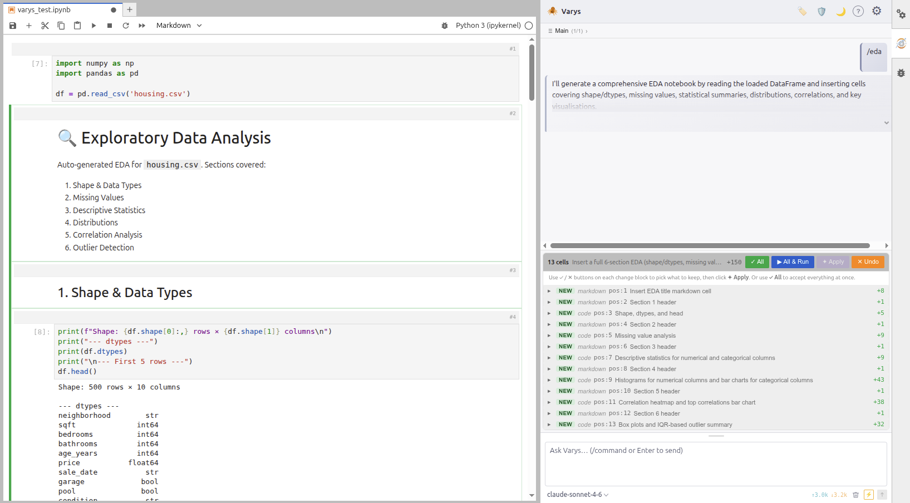
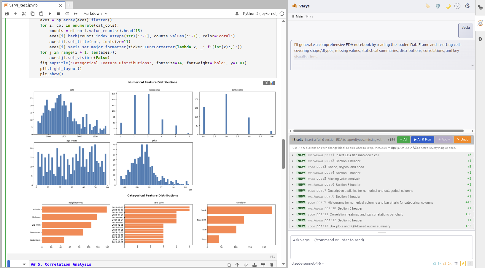
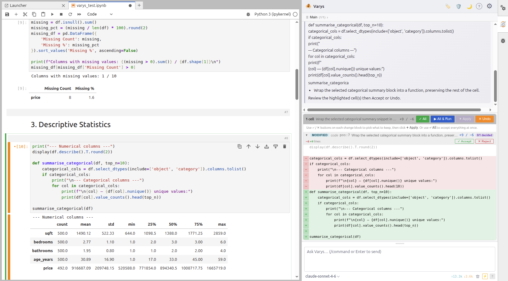
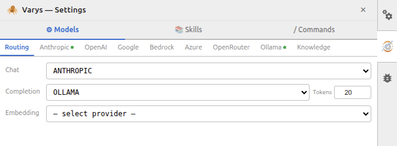
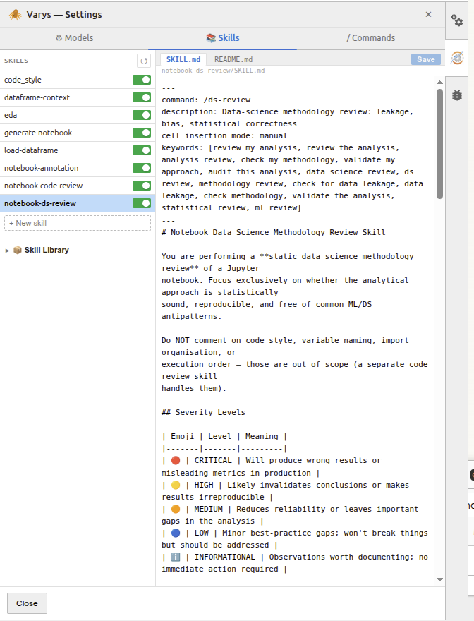
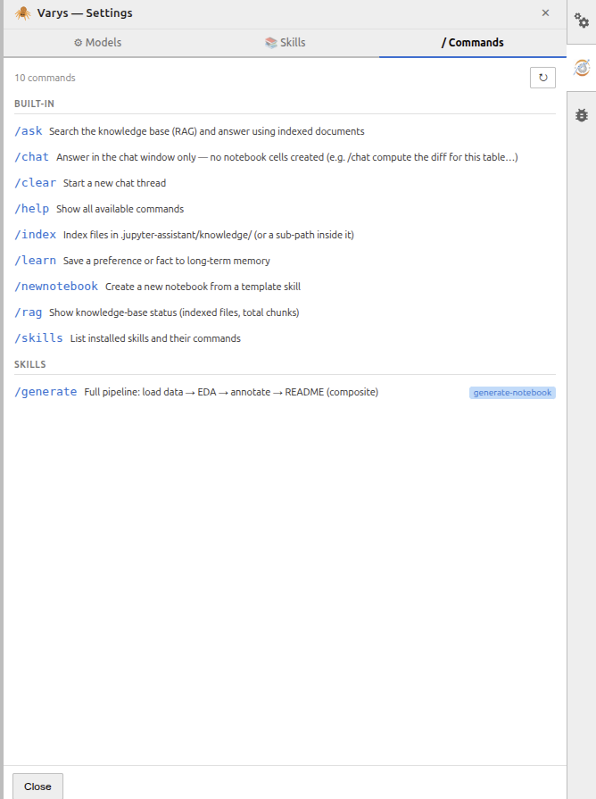
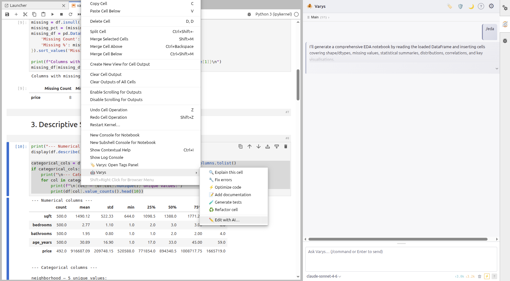

# Varys — AI Data Science Assistant for JupyterLab


[](LICENSE)
[](https://www.python.org/)
[](https://jupyter.org/)

**Varys** is an AI-powered data science assistant that lives inside JupyterLab.
Chat with it, ask it to write code, run EDA, generate plots, review your notebook, or complete your code inline — all without leaving the notebook interface.

No Node.js required on the user's machine. No cloud account lock-in. Works with Anthropic, OpenAI, Google, Ollama (local), AWS Bedrock, Azure OpenAI, and OpenRouter.

> [GitHub](https://github.com/jmlb/varys) · [Install guide](INSTALL.md) · MIT License

---

## Highlights

- **Chat assistant** — ask questions, get code, run multi-step notebook operations in natural language
- **Inline code completion** — ghost-text suggestions as you type, powered by any LLM provider
- **Skill system** — composable prompt skills triggered by `/commands` or keywords; ship your own
- **RAG knowledge base** — index PDFs, notebooks, and markdown; query with `/ask`
- **Multi-provider** — Anthropic, OpenAI, Google Gemini, Ollama (local), AWS Bedrock, Azure OpenAI, OpenRouter
- **Reproducibility guardian** — tracks cell execution and surfaces data-leakage and methodology issues
- **No Node.js needed** — pre-built bundle ships with the package; `pip install` is all it takes

---

## Install

Runtime: **Python ≥ 3.9**, **JupyterLab ≥ 4**.

```bash
# Create a virtual environment (recommended)
python3 -m venv .varys
source .varys/bin/activate

# Install with your LLM provider
pip install "varys[anthropic] @ git+https://github.com/jmlb/varys"   # Claude
pip install "varys[openai]    @ git+https://github.com/jmlb/varys"   # GPT
pip install "varys[all]       @ git+https://github.com/jmlb/varys"   # everything
```

Then launch JupyterLab:

```bash
jupyter lab
```

The Varys icon appears in the left sidebar. Open Settings (⚙) to enter your API key and select a model.

Full install guide (Ollama, RAG, upgrade, uninstall): [INSTALL.md](INSTALL.md)

---

## Screenshots

<details>
<summary>📊 EDA in one command — cell plan</summary>



Typing `/eda` triggers a full exploratory data analysis. Varys reads the loaded DataFrame from the kernel, plans 13 new cells (shape, dtypes, missing values, descriptive statistics, distributions, correlations, outlier detection), and shows a diff panel before inserting anything.

</details>

<details>
<summary>📈 EDA in one command — generated visualisations</summary>



After accepting the plan, Varys inserts and runs all cells. Distribution histograms for numeric features and bar charts for categorical features are generated and rendered directly in the notebook: already wired to the actual column names and dtypes.

</details>

<details>
<summary>🔀 Visual diff view — code refactor</summary>



Before any AI edit is applied, Varys shows a line-level diff: green for additions, red for removals. Each change can be individually accepted or rejected, and the entire operation can be undone atomically.

</details>

<details>
<summary>⚙️ Settings — provider routing</summary>



The Routing tab lets you assign different providers to different tasks. Here, chat uses Anthropic (Claude) while completion uses Ollama (local, free). The token limit for inline completion is configurable inline.

</details>

<details>
<summary>🧠 Settings — Skills editor</summary>



The Skills tab lists all installed skills with enable/disable toggles. Clicking a skill opens its `SKILL.md` and `README.md` for live editing directly in the panel: no file manager needed.

</details>

<details>
<summary>/ Settings — Commands tab</summary>



The Commands tab lists every available slash command (built-in and skill-defined) with descriptions. It updates automatically as skills are added or removed.

</details>

<details>
<summary>🖱️ Right-click context menu — AI actions</summary>



Right-clicking any notebook cell exposes a Varys submenu with one-click actions: Explain this cell, Fix errors, Optimize code, Add documentation, Generate tests, Refactor cell, and Edit with AI.

</details>

---

## Quick start

```
1. Open a notebook in JupyterLab
2. Click the Varys icon in the left sidebar
3. Set your provider + API key in ⚙ Settings → Routing
4. Start chatting
```

### Example prompts

```
load the CSV and show me the first 5 rows
/eda
/plot scatter of price vs sqft colored by neighborhood
/review
what does cell [3] do?
/ask what preprocessing steps are recommended for this dataset?
```

---

## Slash commands

| Command | Description |
|---|---|
| `/eda` | Run EDA — distribution plots, correlation heatmap, summary statistics |
| `/plot <description>` | Generate a publication-quality visualization |
| `/review` | Static code-quality review: bugs, style, maintainability |
| `/ds-review` | Data-science methodology review: leakage, bias, statistical correctness |
| `/readme` | Generate or update the top-cell README for this notebook |
| `/report` | Generate a downloadable markdown report |
| `/load <file>` | Load a CSV / Excel / JSON as a pandas DataFrame |
| `/unittest` | Generate pytest test cases for notebook cell functions |
| `/ask <query>` | Search the RAG knowledge base and answer using indexed documents |
| `/chat <msg>` | Answer in chat only — no notebook cells written |
| `/clear` | Start a new chat thread |
| `/help` | List all available commands |
| `/skills` | List installed skills and their commands |

Skill commands are discovered dynamically — add a skill with a `command:` in its front matter and it appears here automatically.

---

## Providers

| Provider | Extra | API key needed |
|---|---|---|
| **Anthropic** (Claude) | `[anthropic]` | Yes |
| **OpenAI** (GPT / o-series) | `[openai]` | Yes |
| **Google Gemini** | `[openai]`* | Yes |
| **Ollama** (local models) | `[ollama]` | No |
| **AWS Bedrock** | `[all]` | IAM credentials |
| **Azure OpenAI** | `[all]` | Yes |
| **OpenRouter** | `[all]` | Yes |

\* Google uses an OpenAI-compatible endpoint.

Configure each provider in **Settings → Routing**. Keys are stored in `~/.jupyter/varys.env` and never committed to a repo.

---

## Skills

Skills are markdown files with YAML front matter that extend Varys's capabilities. They are injected into the LLM system prompt automatically based on context, keywords, or an explicit `/command`.

```
~/.jupyter-assistant/skills/
    my-skill/
        SKILL.md     ← prompt injected into the LLM
        README.md    ← optional user-facing docs
```

Example `SKILL.md` front matter:

```yaml
---
command: /myskill
description: Does something useful
keywords: [keyword1, keyword2]
---
# Skill instructions here…
```

Bundled skills (ship with Varys): `eda`, `plot`, `review`, `ds-review`, `annotate`, `readme`, `report`, `load`, `generate`, `unittest`, `dataframe-context`, `safe_operations`, `code_style`.

Browse and manage skills in **Settings → Skills**.

---

## Configuration

Settings are stored in `~/.jupyter/varys.env` and hot-reloaded on save — no server restart needed.

```ini
DS_CHAT_PROVIDER=ANTHROPIC
DS_COMPLETION_PROVIDER=OLLAMA
COMPLETION_MAX_TOKENS=128

ANTHROPIC_API_KEY=sk-ant-...
ANTHROPIC_CHAT_MODEL=claude-sonnet-4-6
ANTHROPIC_COMPLETION_MODEL=claude-haiku-4-5

OLLAMA_URL=                          # blank = http://localhost:11434
OLLAMA_COMPLETION_MODEL=qwen2.5-coder:1.5b-instruct
```

All keys can also be set from the Settings panel (⚙) inside JupyterLab.

---

## Optional: Ollama (local models, no API key)

```bash
# Install Ollama (system-wide)
curl -fsSL https://ollama.com/install.sh | sh

# Pull a model
ollama pull qwen2.5-coder:1.5b-instruct   # fast, good for completion
ollama pull qwen2.5-coder:7b-instruct      # higher quality

# Start the server (keep running before launching JupyterLab)
ollama serve
```

In Varys Settings → Routing, set the completion or chat provider to `ollama` and pick your model. Leave `OLLAMA_URL` blank — Varys defaults to `http://localhost:11434`.

---

## Optional: RAG knowledge base

```bash
pip install "varys[rag] @ git+https://github.com/jmlb/varys"
```

Drop PDFs, notebooks, or markdown files into `.jupyter-assistant/knowledge/`, then run `/index` in the chat. Query with `/ask <question>`.

---

## Verify installation

```bash
jupyter labextension list      # varys v0.1.0  enabled  OK
jupyter server extension list  # varys  enabled
```

---

## Upgrade

```bash
pip install --upgrade "varys[all] @ git+https://github.com/jmlb/varys"
```

---

## Uninstall

```bash
pip uninstall varys
```

---

## Development

```bash
git clone https://github.com/jmlb/varys.git
cd varys

python3 -m venv .venv && source .venv/bin/activate
pip install -e ".[all]"

# Frontend (requires Node.js + jlpm)
jlpm install
jupyter labextension build .
jupyter lab
```

After editing Python files, restart the Jupyter server. After editing TypeScript, run `jupyter labextension build .` and hard-refresh the browser.

---

## Project structure

```
varys/
├── varys/                         Python package (server extension)
│   ├── handlers/                  Jupyter Server request handlers
│   ├── llm/                       LLM provider adapters (Anthropic, OpenAI, Ollama…)
│   ├── completion/                Inline code completion engine
│   ├── skills/                    Skill loader and registry
│   ├── bundled_skills/            Skills shipped with the package
│   ├── bundled_config/            Default config files (llm, completion, rag, reproducibility)
│   ├── memory/                    Long-term preference storage
│   ├── modules/                   Feature modules
│   │   └── reproducibility_guardian/  Passive cell-run analysis engine
│   ├── rag/                       RAG knowledge base (indexing + retrieval)
│   ├── report/                    Notebook-to-markdown report generator
│   ├── utils/                     Shared path and config utilities
│   ├── magic.py                   %%ai IPython cell magic
│   └── labextension/              Pre-built frontend bundle
├── src/                           TypeScript / React frontend
│   ├── sidebar/                   Main chat + settings UI (SidebarWidget.tsx)
│   ├── completion/                Inline ghost-text completion provider
│   ├── editor/                    Cell insert / modify / delete operations (CellEditor.ts)
│   ├── context/                   Notebook reader and kernel variable resolver
│   ├── reproducibility/           Reproducibility Guardian React panel
│   ├── tags/                      Cell tags & metadata panel
│   ├── outputs/                   Cell output overlay helpers
│   ├── ui/                        Shared UI components (DiffView, ActionBar)
│   ├── utils/                     LCS diff utilities
│   └── api/                       Backend API client
├── style/                         CSS and icon assets
├── docs/                          Technical deep-dive docs
├── documentation/                 User-facing HTML wiki
├── readme_files/                  Screenshots for README
├── schema/                        JupyterLab settings schema
└── jupyter-config/                Jupyter server extension registration
```

---

## License

MIT — see [LICENSE](LICENSE).

**Author:** Jean-Marc B. · [jmlbeaujour@gmail.com](mailto:jmlbeaujour@gmail.com) · [github.com/jmlb](https://github.com/jmlb)
